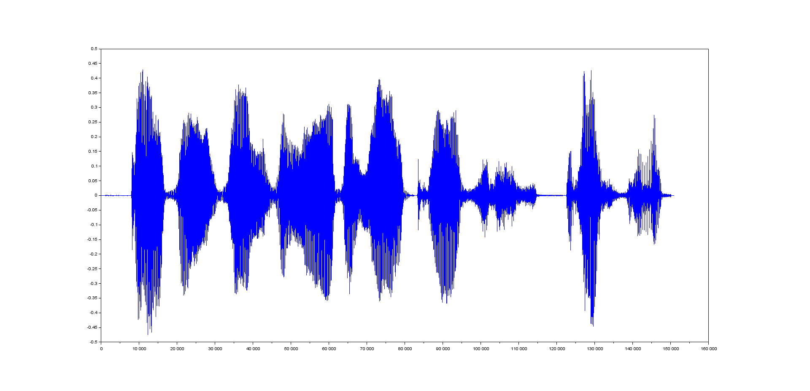
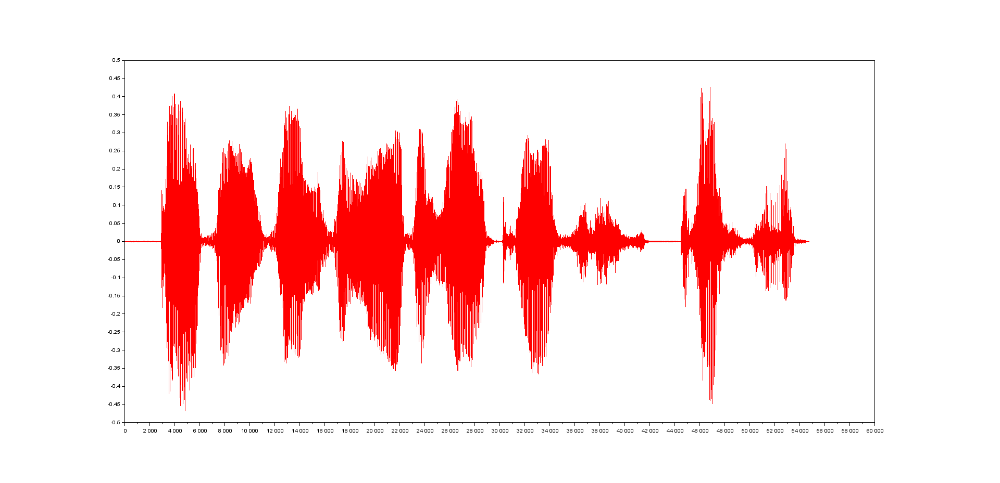
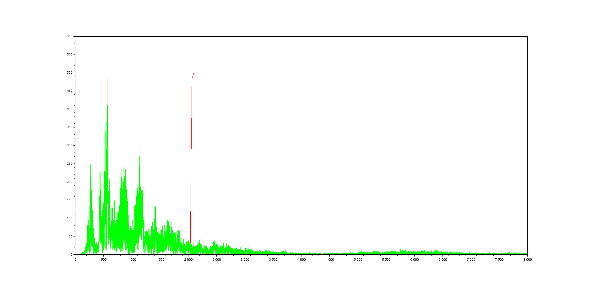

# LightOrgan
## Arduino audio-lichtorgel 

#### Door:

* Milan Willems - <milan.willems@student.ap.be>
* Kevin van de Mieroop - <kevin.vandemieroop@student.ap.be>
* Michiel Mulder - <michiel.mulder@student.ap.be>

#### Leerkracht

* Patrick Van Houtven - <patrick.vanhoutven@ap.be>
* Marc Smets - <marc.smets@ap.be>

#### Opgave

> 1. Ontwerp een systeem waarbij een geluidssignaal gesampeld wordt met een sampelfrequentie van 16 kHz. Sla de sampelwaarden op in het geheugen(SPI).
> 2. Bouw een lichtorgel met 3 kanalen: 0Hz-750Hz, 800Hz-2kHz en 2050Hz-8kHz. De weergave gebeurt door middel van LED’s. De intensiteit van waarmee de led brandt moet overeenkomen met de gemiddelde amplitude binnen de betreffende frequentieband..
> 3. Genereer een echosignaal.
> 4. Bouw een uitbreidingsschakeling voor de Arduino microcontroller zodat het gesampelde signaal via een digitaal-analoog conversie kan weergegeven worden via luidsprekers.
> Los deze opgave op via simulatie in SCILAB en via een praktische verwezenlijking met een Arduino Due microcontroller.

#### Simulatie

Ons lichtorgel of *lightorgan* heeft als doel een inkomend signaal op te delen in drie frequentieklassen om zo drie verschillende LED's aan te sturen. Dit doen we met behulp van een *lowpass-*, *bandpass-* en *highpass*-filter. Deze zullen respectievelijk werken op frequenties 0Hz tot 750Hz, 800Hz tot 2kHz en 2.05kHz tot 8kHz. In dit deel beschrijven we hoe de simulatie in scilab gebeurt voor deze filters.

Als signaal hanteren we *.wav*-geluidsbestand. Specifieker is dit .wav-bestand afkomstig van het bekende youtube filmpje ['Double rainbow guy'](https://www.youtube.com/watch?v=99E9fDgZZuE).

##### Inlezen geluidssignaal

File: */scilab/loadwave.sce*

Het inlezen van het geluidssignaal gebeurt door de `wavread()`-functie in scilab. [`wavread`](https://help.scilab.org/docs/6.0.0/en_US/wavread.html) geeft een output in `y` (gesamplede data), `Fs` of frequentie in Hertz en `bits` of het aantal bits per sample gebruikt om de data in de file te encoden.  

        [y,Fs,bits] = wavread(rainbow);

De uitgelezen data komt in `y`. De frequentie `Fs` bedraagt zoals bij de meeste soundfiles 44.1kHz. De `bits` zijn de quantisatiebits, gebruikt bij het encoden van dit signaal. Deze laatste hebben we niet nodig in onze simulaties. De parameter `rainbow` die we meegeven in `wavread` bevat de locatie van het wav-bestand (bv. "C:/User/username/Documents/rainbow.wav"). 

`Fs` bevat een frequentie van 44.1kHz. Deze sample rate zetten we om naar 16kHz met behulp van de [`intdec`](https://help.scilab.org/docs/6.0.0/en_US/intdec.html)-functie. Deze beoogt het veranderen van de sample rate van een signaal. Hierbij geven we het signaal als eerste parameter, samen met de conversie factor voor het nieuwe signaal.

        conversion_factor = 16000/Fs;
        y2 = intdec(y,conversion_factor);

Om het `y2`-signaal decomposeren naar zijn sinuso&iuml;dale componenten gebruiken we [`fft`](https://help.scilab.org/docs/6.0.0/en_US/fft.html)-functie. Verder hebben we ook een frequentievector nodig om het omgevormde signaal correct te plotten.

        Frequentie_FFT = abs(fft(y2));
        Fv = 16000*(0:(y2_size/2))/y2_size;
        //...
        plot(Fv,Frequentie_FFT(1:n), "g");

**Signaal resultaten**

Wanneer we `y` plotten bekomen we volgend signaal:

        [y,Fs,bits] = wavread(rainbow);

Na de aanpassing van de sample rate naar 16kHz, bekomen we voor `y2`:

        conversion_factor = 16000/Fs;
        y2 = intdec(y,conversion_factor);

Beide plots:

We spelen het signaal ook af met behulp van `playsnd()`, om te verifi&euml;ren of het bestand correct is ingeladen.

        playsnd(y2, 16000);

##### Filters

* **Lowpass filter of laagdoorlaatfilter**

File: */scilab/lowpass.sce*

Om er voor te zorgen dat de lage frequenties worden afgezonderd voor de groene LED, gebruiken we een laagdoorlaatfilter. Deze snijdt de frequenties vanaf 750Hz af, opdat we enkel deze van 0 tot 750Hz krijgen.

De filters kunnen we simuleren met behulp van de [`wfir`](https://help.scilab.org/docs/6.0.0/en_US/wfir.html)-functie:

Syntax: `[wft,wfm,fr]=wfir(ftype,forder,cfreq,wtype,fpar)`
    - `wft` = time domain filter coefficients
    - `wfm` = frequency domain filter respons on grif `fr`
    - `fr` = frequency grid
Met de volgende parameters:
    - `ftype` for low-pass filter is `'lp'` (`'hp'` voor high-pass en `'bp'` band pass)
    - `forder`
    - `cfreq` = cutoff bij lpf = 750Hz => [0.5:0.5]-schaal: 750/16000 = 0,046875.
    - `wtype` = window type
    - `fpar` = window parameters

Om het signaal uit ons `loadwave.sce` bestand te gebruiken zetten we het signaal om in zijn sinusoidale componenten aan de hand van de fast fourrier transform functie: `fft`. Dit geef het signaal in zijn frequentiedomein.

Tezamen:

Met `wfir` bepalen we de filterco&euml;fficienten, -amplitude en frequentie:

        [LD_coeff,amplitude,f] = wfir("lp",1600,[0.047 0],"hm", [0 0]);

De 3 waardes die we als output krijgen van de `wfir`-functie zetten we om naar 'scilab-formaat' zodat deze gebruikt kan worden door de `flts()` formaat:

        LD_polynoom = poly(LD_coeff, 'z', 'coeff');

        LD_functie = horner(LD_polynoom, 1/%z);

        LD_lineair = syslin('d', LD_functie);

        LD_output = flts(Frequentie_FFT, LD_lineair);

Zo krijgen we de afsnijfrequentie van de lowpassfilter te zien op onze niet-periodieke waardes van ons signaal (na de Fourier transformatie).

* **Highpass filter of hoogdoorlaatfilter**

File: */scilab/highpass.sce*

De highpass filter kunnen we analoog met de lowpass filter instellen. We specifieren in de `wfir` dat het gaat om de highpass met `'hp'`. De console meldt dat de filter order oneven moet zijn. We gebruiken hier dus 1601.

Verder gebruiken we als frequentieparameter: 2050/16000 = 0.128125

De `wfir`-functie ziet er voor de hoogdoorlaatfilter als volgt uit:

        [LD_coeff,amplitude,f] = wfir("hp",1601,[0.128125 0],"hm", [0 0]);

Zo krijgen we de afsnijfrequentie van de highpass filter te zien in het frequentiedomein.

* **Bandpass filter of banddoorlaatfilter**

File: */scilab/bandpass.sce*

Hetzelfde geldt voor de bandpass filter. Bij de bandpass moeten we echter wel twee frequentieparameters specifieren:
        + 800/16000 = 0.05
        + 2000/16000 = 0.125

De `wfir`-functie ziet er als volgt uit:

        [LD_coeff,amplitude,f] = wfir("bp",1601,[0.05 0.125],"hm", [0 0]);

Met het resultaat:

Alle filters samen geeft:

Met alle signalen tezamen:

