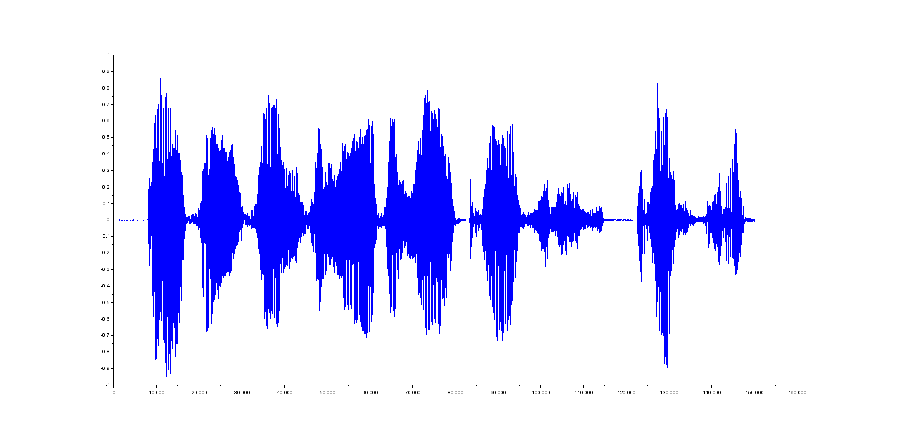
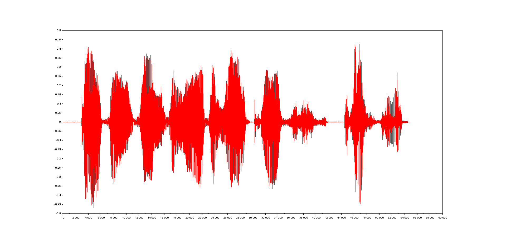
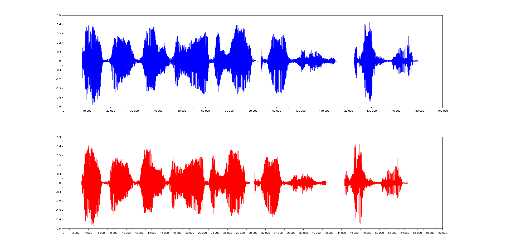
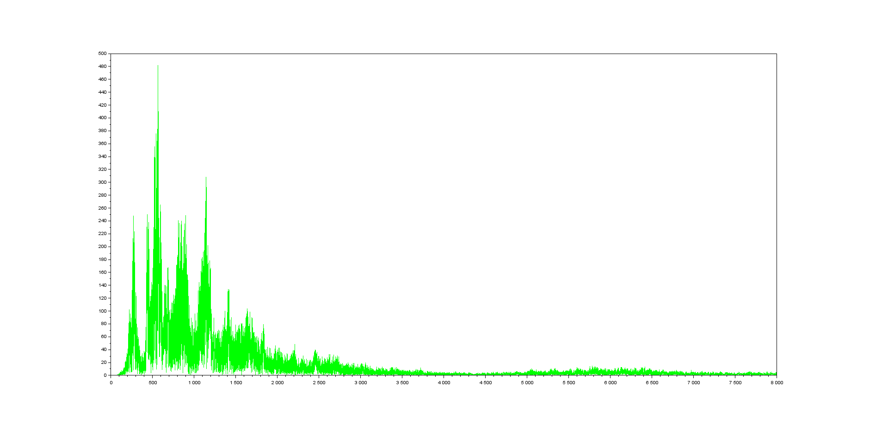
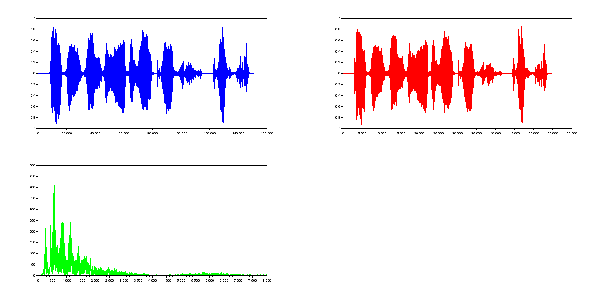
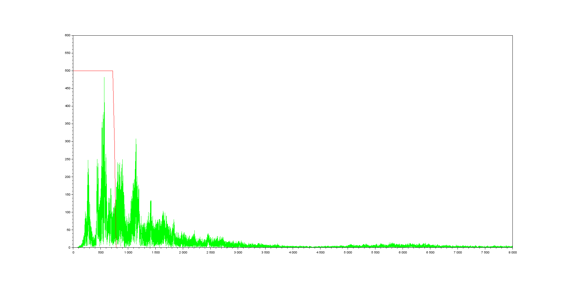
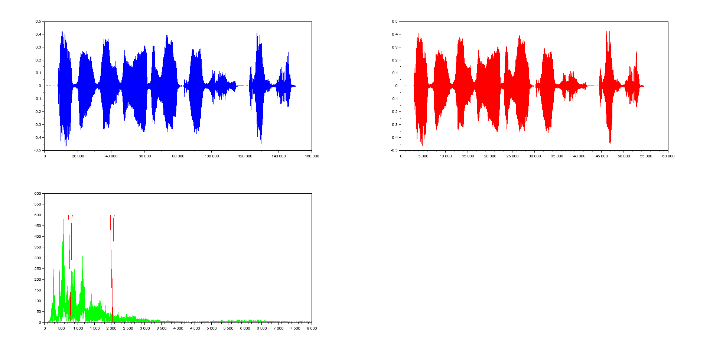

# SciLab LOG

### Simulation in Scilab

##### Sample frequentie - WAV

* [Audio info](https://help.scilab.org/doc/5.5.2/en_US/section_d11cd0f9e362390f953e7199c5bb4b3a.html)
* [Signal info](https://help.scilab.org/docs/6.0.0/en_US/section_dbbac6be408104de3049eddefaf6b9c9.html)
* Opties zijn `auread`, `loadwave` en `wavread`.
* Beide `wavread` en `loadwave` gebruiken een .wav file als input. 
   - `auread` maakt gebruik van een .au file. .au is Unix-gerelateerd, dus wij zullen eerder voor .wav gaan. 
   - `loadwave` geeft een matrix en vectors als output.
   - `wavread` geeft een output in `y` (gesamplede data), `Fs` of frequentie in Hertz en `bits` of het aantal bits per sample gebruikt om de data in de file te encoden. 
* We gebruikten initieel 'leeroy jenkins' als audio file, maar heeft een te hoge amplitude.
* Deze hebben we vervangen door de 'double rainbow' van het bekende [youtube](https://www.youtube.com/watch?v=99E9fDgZZuE) filmpje.
* Verder over wavread, de description:

> - Utility function to read .wav sound file. wavread(wavfile) loads a sound file specified by the string wavfile, returning the sampled data in y. Amplitude values are in the range [-1,+1]. Supports multi-channel data in the following formats: 8-bit mu-law, 8-, 16-, and 32-bit linear, and floating point.
> - [y,Fs,bits]=wavread(wavfile) returns the sample rate (Fs) in Hertz and the number of bits per sample used to encode the data in the file.
> - wavread(wavfile,n) returns the first n samples from each channel.
> - wavread(wavfile,[n1,n2]) returns samples n1 to n2.
> - wavread(wavfile,'size') returns the size of the audio data contained in the file in place of the actual audio data, returning the vector as [channels samples].
> - wavread(wavfile,'info') returns information about the audio data contained in the file in place of the actual audio data, returning the vector as [data format, number of channels, samples per second per channel, estimate of bytes per second needed, byte alignment of a basic sample block, bits per sample, length of sound data in bytes, bytes per sample (per channel)].

* Wanneer we ons eerste script lossen op onze 'rainbow', zien we in de variabelen dat het bestand gesampled wordt tegen een frequentie van 44100 Hz met 16 bits per sample. Dit is redelijk standaard.
* Een plot van deze `y` output geeft

* Met `intdec` kunnen we een nieuwe samplefrequentie instellen voor ons `y` signaal.
* Wanneer we dit signaal plotten zien we dat het 2e signaal (rood) aanzienlijk minder samples bevat dan het eerste signaal.

* Beide plots onder elkaar geplaatst:

* Size van blauw signaal 1, `y` = 150 912
* Size van rood signaal 2, `y2` = 54 752

##### Low-pass filter

* We kunnen een analoge lowpass filter simuleren in scilab met `analpf` ([bron](https://help.scilab.org/docs/6.0.0/en_US/analpf.html)).
* Syntax: `[wft,wfm,fr]=wfir(ftype,forder,cfreq,wtype,fpar)`
    - `wft` = time domain filter coefficients
    - `wfm` = frequency domain filter respons on grif `fr`
    - `fr` = frequency grid
* Voor de `wfir` function, de volgende parameters:
    - `ftype` for low-pass filter is `'lp'` (`'hp'` voor high-pass en `'bp'` band pass)
    - `forder`
    - `cfreq` = cutoff bij lpf = 750Hz => [0.5:0.5]-schaal: 750/16000 = 0,046875.
    - `wtype` = window type
    - `fpar` = window parameters

* Om het signaal uit ons `loadwave.sce` bestand te gebruiken zetten we het signaal om in zijn sinusoidale componenten aan de hand van de fast fourrier transform functie: `fft`

* Tezamen:

* Met `wfir` bepalen we de filterco&euml;fficienten, -amplitude en frequentie:

        [LD_coeff,amplitude,f] = wfir("lp",1600,[0.047 0],"hm", [0 0]);

* Deze 3 waardes zetten we om naar 'scilab-formaat' zodat deze gebruikt kan worden door de `flts()` formaat:

        LD_polynoom = poly(LD_coeff, 'z', 'coeff');

        LD_functie = horner(LD_polynoom, 1/%z);

        LD_lineair = syslin('d', LD_functie);

        LD_output = flts(Frequentie_FFT, LD_lineair);

* Zo krijgen we de lowpassfilter te zien op onze niet-periodieke waardes van ons signaal (na de Fourier transformatie dus).

##### Highpass filter
* De highpass filter kunnen we analoog met de lowpass filter instellen.

* We specifieren in de `wfir` dat het gaat om de highpass met `'hp'`. De console meldt dat de filter order oneven moet zijn. We gebruiken hier dus 1601.

* Verder gebruiken we als frequentieparameter: 2050/16000 = 0.128125

* De `wfir`-functie ziet er als volgt uit:

        [LD_coeff,amplitude,f] = wfir("hp",1601,[0.128125 0],"hm", [0 0]);

* Zo krijgen we de higpass filter te zien

##### Bandpass filter

* Hetzelfde geldt voor de bandpass filter.

* Bij de bandpass moeten we twee frequentieparameters specifieren:
        + 800/16000 = 0.05
        + 2000/16000 = 0.125

*  De `wfir`-functie ziet er als volgt uit:

        [LD_coeff,amplitude,f] = wfir("bp",1601,[0.05 0.125],"hm", [0 0]);

* Met het resultaat:

* Alle filters samen geeft:

* Met alle signalen tezamen:

